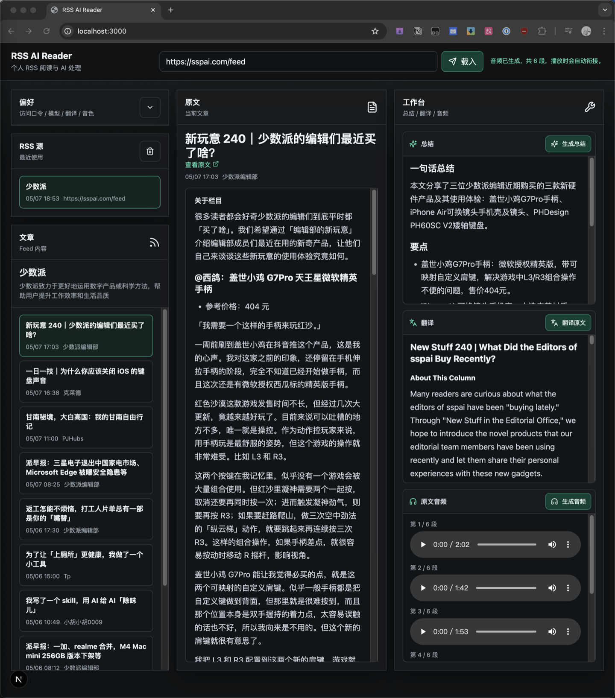

# RSS AI Reader

一个面向个人使用的 RSS 阅读与 AI 辅助处理工具，适合部署在 Vercel。前端负责订阅管理、文章浏览和参数选择；Next.js Route Handlers 负责 RSS 代理解析、正文抓取、AI 总结/翻译，以及 Azure Speech 音频生成。

## 功能

- 读取 RSS 源并展示订阅信息和文章列表
- 在服务端抓取原文页面，并尽量提取正文内容
- 支持 OPML 导入、导出和拖拽导入
- 在浏览器本地保存 RSS 订阅和页面偏好
- 支持使用 OpenAI、DeepSeek 或 Gemini 模型生成总结和译文
- 支持使用 Azure Speech 分段生成全文朗读音频
- 支持在页面内选择模型、翻译目标语言、朗读语言、音色和语速
- 可通过 `APP_TOKEN` 为 API 添加简单访问保护

## 环境变量

```bash
# 访问保护，可选
APP_TOKEN=

# AI 服务，按需配置
OPENAI_API_KEY=
OPENAI_BASE_URL=
DEEPSEEK_API_KEY=
DEEPSEEK_BASE_URL=
GEMINI_API_KEY=
GEMINI_BASE_URL=

# Azure Speech，生成音频时需要
AZURE_SPEECH_KEY=
AZURE_SPEECH_REGION=
AZURE_SPEECH_BASE_URL=
```

## Vercel 部署

[](https://vercel.com/new/clone?repository-url=https://github.com/deanxizian/rss_web&project-name=rss-web)

## 项目截图


